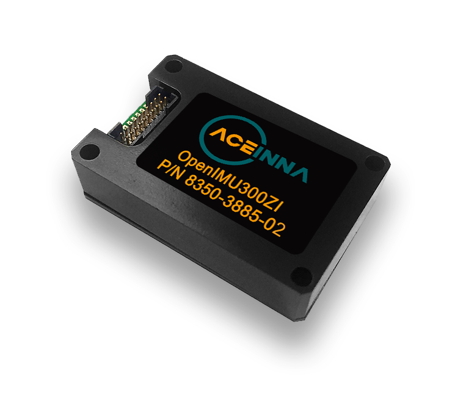

OpenIMU300ZI - *EZ Embed* Industrial Module
===========================================
.. contents:: Contents
    :local:

The following image shows the OpenIMU300ZI unit.  

The OpenIMU300ZI *EZ Embed* module integrates highly-reliable MEMS inertial
sensors (acceleration, angular rate/gyro, and
magnetic field) in a miniature factory-calibrated package to provide
consistent performance through the extreme
operating environments.

OpenIMU300ZI has excellent acceleration and gyro performance that matches
systems ten times more expensive.
It is easy to synchronize and interface with external GPS, as well as other
sensors.

* Integrated 3-Axis Angular Rate
* Integrated 3-Axis Accelerometer
* Integrated 3-Axis Magnetic Sensor
* 168MHz STM32 M4 CPU
* SPI / UART Interfaces
* Update Rate to 800Hz
* Synchronization Input
* In-System Upgrade
* Small Size (24x37x9.5mm)
* Drop-in Upgrade for IMU380ZA, IMU381ZA
* Wide Temp Range -40 to 85 |deg| C
* High Reliability > 50,000hr MTBF

	

	
	
Specifications
---------------

.. toctree::
    :maxdepth: 1

    300ZI/electrical-specs
    300ZI/mechanical
    300ZI/schematic
	
Interfaces
-----------

.. toctree::
    :maxdepth: 1
	
    300ZI/spi-uart

Pinout
----------
.. toctree::
    :maxdepth: 1
	
    300ZI/pinout
    300ZI/arm-cortex-cpu
	
Eval Kit
----------
.. toctree::
    :maxdepth: 1
	
    300ZI/EVB-OpenIMU300ZI
    300ZI/evb
	
Ready to Use Application
--------------------------
	
To learn about ready to use apps available for immediate download to your OpenIMU, please see the following
page: 

1. `Ready-to-Use-Applications <https://openimu.readthedocs.io/en/latest/apps.html>`__
2. `Aceinna Navigation Studio - Getting Started <https://developers.aceinna.com/docs/install>`__

.. include:: <isonum.txt>

