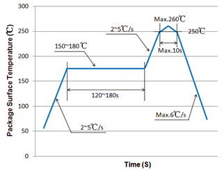
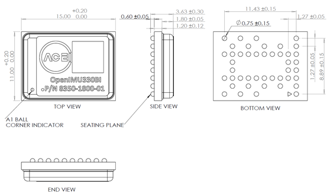

OpenIMU330BI SMT Process
==========================
.. contents:: Contents
    :local:
	
LAND PATTERN
--------------

1.	Recommended land pattern of PCB is shown in Figure 1.

.. figure:: ./_images/OpenIMU330BI_Land_Pattern_PCB.png
    :align: center

    **Figure 1: Recommended land pattern (unit: mm)**

SOLDER REFLOW PROFILE
-----------------------

1.	BGA ball material is SAC305.
2.	The carrier board material of OpenIMU330BI is suggested Tg180 FR4. 
3.	Reflow profile for Pb free process
4.	Reflow is limited by 2 times. Second reflow should be applied after device has cooled down to room temperature (25℃).
5.	Recommended reflow profile for Pb free process is shown in Figure 2. The time duration of peak temperature (260℃) should be limited to 10 seconds.
6.	Type 4 solder paste is recommended for a better SMT quality.
7.	Use no clean flux to avoid product contaminated by cleaning solvent.
8.	It is recommended use underfill glue to manage certain threats to the integrity of the solder joints of the OpenIMU330BI, including peeling stress and extended exposure to vibration. and underfill glue was not required that do not anticipate exposure to these types of mechanical stresses.

    **Figure 2: Recommended solder reflow profile**
	

PACKAGE OUTLINE DRAWING
--------------------------

Dimensions are in mm

    **Figure 3: Mechanical package outline dimensions**
	

OpenIMU330BI Land Pattern,Solder Reflow Profile and Packeage Outline doc  :download:`download <./_docs/OpenIMU330BI Land Pattern, Solder Reflow Profile and Packeage Outline Dr.docx>`