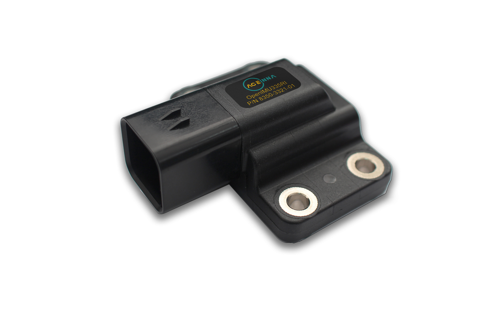

OpenIMU335RI - Rugged Industrial CAN Module
===========================================
.. contents:: Contents
    :local:

Introduction
-------------

    OpenIMU335 Module

The ACEINNA OpenIMU335RI is an easy-to-use high-performance 6-DOF (9 DOF is optional) open inertial platform packaged in a rugged 
sealed over-molded plastic housing. The OpenIMU335RI includes triple-redundant 3-Axis MEMS accelerometers and rate 
gyros which are fully calibrated over the operating temperature range. A 3-axis magnetic sensor is also available as an 
option. The processing power is provided by a 168MHz ARM M4 CPU with a Floating Point Unit. The OpenIMU335RI runs 
the OpenIMU open-source stack that includes an optimized 16-state Kalman Filter for Attitude and GPS-Aided PositionVelocity-Time (PVT) measurement. 
A free tool-chain based on VS Code supports PC, MAC, and Ubuntu.

*   Hardware
  
    *   0.1 degrees of accuracy over temperature and angle
    *   Precision 3-axis MEMS Accelerometer
    *   Low-Drift 3-axis MEMS angular rate sensor
    *   Triple-redundant architecture with fault detection
    *   3-axis AMR Magnetometer (Optional)
    *   CAN 2.0 and RS232 Interfaces
    *   168 MHz ARM M4 
    *   Wide Temp Range, -40C to +85C
    *   Wide Supply Voltage Range, 9 V – 32 V
    *   IP67 Ampseal Connector
    *   High Reliability, MTBF > 50k hour

|

*   Firmware and Firmware Support
    
    *   In-System Firmware Upgrade
    *   Open Source Tool Chain
    *   Open Source Algorithms (VG / AHRS / INS)
    *   Built in 16-State Open Source Extended State Kalman Filter
    *   Open Community & Support
    *   Aceinna Navigation Studio Interface

The default coordinate frame for the OpenIMU335RI is given in the below image.
The coordinate frame can be changed via RS-232 or CAN message. Refer to the user manual of the part for details.

.. figure::  media/OpenIMU335RI_CoordinateFrame.png
    :width: 5.11in
    :height: 4.75in
    :align: center

    OpenIMU335RI Default Coordinate Frame

OpenIMU335 Product Page
------------------------
    
The OpenIMU335RI product page is at: `<https://www.aceinna.com/inertial-systems/OpenIMU335RI>`_. 
    

Datasheet
----------

The datasheet of the OpenIMU335RI can be downloaded from this `datasheet link <https://navview.blob.core.windows.net/web-resources/6020-3321-01_A%20OpenIMU335RI.pdf?_t=1621434422158>`_. 
Refer to this document for:

*   Detailed Specifications

    *   Performance
    *   Electrical
    *   Physical
    *   Environmental
    *   EMC

*   Features
*   Qualifacation Plan Summary
*   Module Dimensions
*   Part Ordering Information

User Manual
------------

The user manual for the OpenIMU335RI can be downloaded from this `user manual link <https://navview.blob.core.windows.net/web-resources/7430-3321-01%20User%20Manual%20OpenIMU335.pdf?_t=1621434422173>`_.
Refer to this document for details of the:

*   Electrical and Mechanical Interfaces
*   Theory of Operation
*   Safety Features
*   CAN Inferface and CAN Messages
*   RS-232 Interface and RS-232 Messages
*   Bootloader
*   Warranty and Support Information

Eval Kit
----------
.. toctree::
    :maxdepth: 1
	
    335RI/EVB-OpenIMU335RI

OpenIMU Development Environment
--------------------------------

For details of the OpenIMU development environment refer to:

.. toctree::
    :maxdepth: 1

    intro/what-is-openimu

Ready to Use Applications
--------------------------
	
To learn about Ready-to-Use-Apps information & available for immediate download to your OpenIMU, please see the following
pages: 

1. `Ready-to-Use-Applications Information <https://openimu.readthedocs.io/en/latest/apps.html>`__
2. `Need to run the OpenIMU server before running one of the ready to use applications <https://developers.aceinna.com/devices/connect>`__
3. `Then upload a prebuilt app to your OpenIMU <https://developers.aceinna.com/code/apps>`__

.. include:: <isonum.txt>
