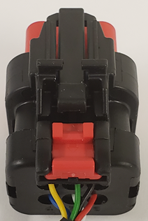

OpenIMU335RI Eval Kit
=====================

.. contents:: Contents
    :local:

**OpenIMU335RI Evaluation Kit Introduction**

The OpenIMU evaluation kit is a hardware platform used to evaluate the
OpenIMU335RI inertial navigation system and develop various applications
based on this platform.  A difference to standard part is that a JTAG (SWD) 20-pin header is 
brought out for code development.  It is supported by Aceinna Navigation Studio,
which enables the user to quickly evaluate the part.
The Components section below details the contents of the kit.

.. note::

    An external DC power supply is required.  The power supply must be able to provide 100mA at 9VDC to 32VDC.

.. image:: images/OpenIMU335_EvalKit.png
    :height: 400
    :align: center

**OpenIMU335RI Evaluation Kit components**

OpenIMU335RI Evaluation Kit fixture and JTAG header board

*   The OpenIMU335RI unit with JTAG header board are mounted on the test fixture.
    The JTAG header provides a means to debug/upload applications to the evaluation unit.

    .. image:: images/OpenIMU335_EvalBoard.png
       :height: 400
       :align: center

ST-Link debugger

*   The ST-Link V2 programmer / debugger is a standard JTAG SWD debugger provided by STMicroelectronics company.
    It is used for in-system debugging/uploading of applications via SWD interface.

    .. image:: ../media/STLink.png
       :height: 400
    

OpenIMU335RI Breakout Cable

*   An included cable provides a means of connecting the unit to a PC via RS232 interface, connecting the unit to the CAN bus, and powering the unit.
    The next table shows the connector pin assignments of the supplied cable.

    +-------------+------------+------------+-----------+-----------+
    | Signal Name || Unit      || RS232     || CAN      || Power    |
    |             || Connector || Connector || Connector|| Wires    |
    +-------------+------------+------------+-----------+-----------+
    | GND         |    3       |   5        |           |  Black    |
    +-------------+------------+------------+-----------+-----------+
    | VIN         |    6       |            |           |  Red      |
    +-------------+------------+------------+-----------+-----------+
    | RS232 TX    |    5       |   2        |           |           |
    +-------------+------------+------------+-----------+-----------+
    | RS232 RX    |    4       |   3        |           |           |
    +-------------+------------+------------+-----------+-----------+
    | CAN H       |    1       |            | 7         |           |
    +-------------+------------+------------+-----------+-----------+
    | CAN L       |    2       |            | 2         |           |
    +-------------+------------+------------+-----------+-----------+

**OpenIMU335RI Connector** 

The connector of the breakout cable is shown in the following image. 
See the notes below for details of how to connect to and disconnect from the OpenIMU335RI.

The pin numbers are as follows:

.. figure:: ../media/OpenIMU335RI_ConnectorPinNumbers.png

.. note::
    To connect the cable to the OpenIMU300RI evaluation unit:
	
    *   Align the keys on the unit and the cable connector.
    *   Push the 6-pin cable connector into the unit connector until lock clicks.
    *   If an extra lock is required - push the red latch under the black latch.  This prevents the disengagement button from being depressed.

.. note::
    To disconnect the cable from the from OpenIMU335RI evaluation unit:
	
    *   If engaged, pull the red latch away from the connector toward the cable.
    *   Push down on the black disengagement button in the middle of the connector.
    *   Pull the cable connector away from the unit.

OpenIMU335RI Evaluation Kit Setup
====================================

To get started with the OpenIMU335RI evaluation kit connect the breakout cable to the evaluation kit.

*   Connect the RS232 connector of the cable to a PC if you wish to evaluate using Aceinna Navigation Studio.
*   To evaluate the part using the CAN interface simply connect to either a CAN analyzer, or network, and refer to the CAN Port Interface Definition section of the `user manual <https://navview.blob.core.windows.net/web-resources/7430-3321-01%20User%20Manual%20OpenIMU335.pdf?_t=1621434422173>`_.
*   Connect RED (+) and BLACK (GND) wires to an external power supply (9 - 32V, 0.1A) 

Refer to the `Aceinna Navigation Studio website <https://developers.aceinna.com/>`_ where there is documentation on how to:

*   Download a PC server application that will allow you to evaluate the part over the RS-232 interface using the Chrome® web browser: https://developers.aceinna.com/devices/connect
*   Update the firmware on the OpenIMU335RI using one of Aceinna’s pre-compiled applications: https://developers.aceinna.com/code/apps
*   Install the OpenIMU programming environment for user code development: https://developers.aceinna.com/docs/install
   
The following activities are addressed in the :ref:`Tools` section:

*   How to uload an App via JTAG
*   Debugging with the PlatformIO Debugger and JTAG Debug Adapter
*   Graphing & Logging IMU Data using the Acienna Navigation Studio
  

**OpenIMU Evaluation Kit Important Notice**

::

     This evaluation kit is intended for use for FURTHER ENGINEERING, DEVELOPMENT,
     DEMONSTRATION, OR EVALUATION PURPOSES ONLY. It is not a finished product and may not (yet)
     comply with some or any technical or legal requirements that are applicable to finished products,
     including, without limitation, directives regarding electromagnetic compatibility, recycling (WEEE),
     FCC, CE or UL (except as may be otherwise noted on the board/kit). Aceinna supplied this board/kit
     "AS IS," without any warranties, with all faults, at the buyer's and further users' sole risk. The
     user assumes all responsibility and liability for proper and safe handling of the goods. Further,
     the user indemnifies Aceinna from all claims arising from the handling or use of the goods. Due to
     the open construction of the product, it is the user's responsibility to take any and all appropriate
     precautions with regard to electrostatic discharge and any other technical or legal concerns.
     EXCEPT TO THE EXTENT OF THE INDEMNITY SET FORTH ABOVE, NEITHER USER NOR ACEINNA
     SHALL BE LIABLE TO EACH OTHER FOR ANY INDIRECT, SPECIAL, INCIDENTAL, OR
     CONSEQUENTIAL DAMAGES.
     No license is granted under any patent right or other intellectual property right of Aceinna covering
     or relating to any machine, process, or combination in which such Aceinna products or services might
     be or are used.
