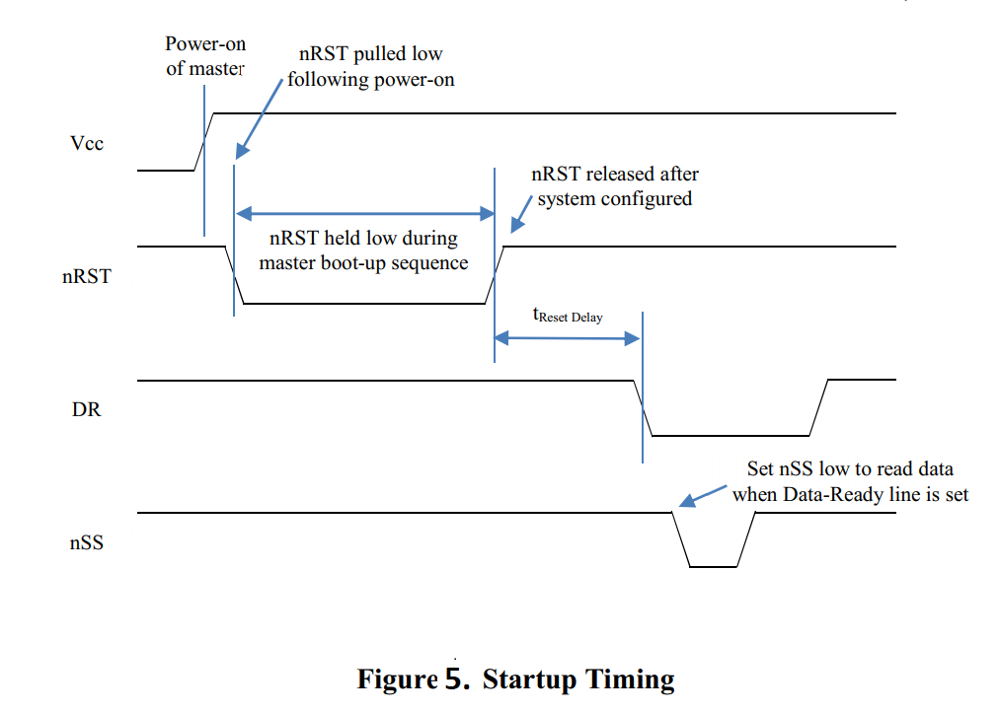
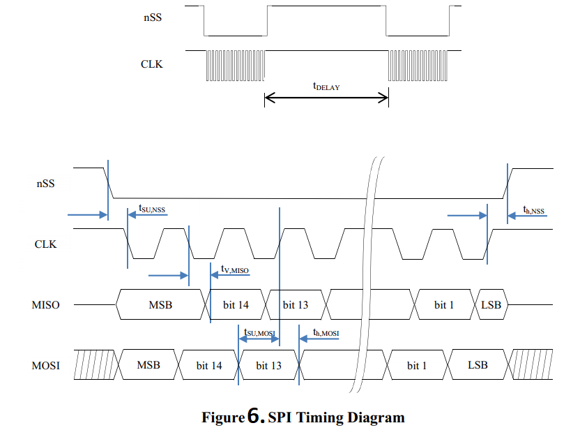

OpenIMU SPI Messaging Framework
================================

.. contents:: Contents
    :local:

**1. Introduction**

    OpenIMU supports a SPI interface for data communications as a one of the choices. To enforce SPI interface mode 'Data Ready' signal needs to be forced HIGH of left unconnected on system startup. OpenIMU SPI interface signals described :doc:`here <../300ZI/pinout>`.
	
    OpenIMU operates as a slave device. 
    
    
**2. OpenIMU SPI communication model**

    OpenIMU has 128 8-bit registers accessible via SPI interface for reading and writing. 
    The usage of these registers is completely user-defined in time of FW development.
    Access to the few registers is implemented in the examples as a reference:

	Table 1. SPI registers used in the examples
	
    +---------------------+----------------+----------------+-----------------+-----------------------+
    || Register Number    || Access Type   || Access Type   |  **Function**   | **Notes**             |
    ||                    || OpenIMU300ZI  || OpenIMU330BI  |                 |                       |
    +---------------------+----------------+----------------+-----------------+-----------------------+
    | 4,5   (0x04, 0x5)   |    r           |    r           | X-Rate          | MSB in reg.4 (Note 1) |
    +---------------------+----------------+----------------+-----------------+-----------------------+
    | 6,7   (0x06, 0x7)   |    r           |    r           | Y-Rate          | MSB in reg.6 (Note 1) |
    +---------------------+----------------+----------------+-----------------+-----------------------+
    | 8,9   (0x08, 0x9)   |    r           |    r           | Z-Rate          | MSB in reg.8 (Note 1) |
    +---------------------+----------------+----------------+-----------------+-----------------------+
    | 10,11 (0x0A, 0xB)   |    r           |    r           | X-Accel         | MSB in reg.10 (Note 2)|
    +---------------------+----------------+----------------+-----------------+-----------------------+
    | 12,13 (0x0C, 0xD)   |    r           |    r           | Y-Accel         | MSB in reg.12 (Note 2)|
    +---------------------+----------------+----------------+-----------------+-----------------------+
    | 14,15 (0x0E, 0xF)   |    r           |    r           | Z-Accel         | MSB in reg.14 (Note 2)|
    +---------------------+----------------+----------------+-----------------+-----------------------+
    | 16,17 (0x10, 0x11)  |    r           |    N/A         | X-MAG           | MSB in reg.16 (Note 3)|
    +---------------------+----------------+----------------+-----------------+-----------------------+
    | 18,19 (0x12, 0x13)  |    r           |    N/A         | Y-MAG           | MSB in reg.18 (Note 3)|
    +---------------------+----------------+----------------+-----------------+-----------------------+
    | 20,21 (0x14, 0x15)  |    r           |    N/A         | Z-MAG           | MSB in reg.20 (Note 3)|
    +---------------------+----------------+----------------+-----------------+-----------------------+
    | 22,23 (0x16, 0x17)  |    r           |    r           | Board-Temp      | MSB in reg.22 (Note 4)|
    +---------------------+----------------+----------------+-----------------+-----------------------+
    | 24,25 (0x18, 0x19)  |    r           |    r           | Sensor-Temp     | MSB in reg.24 (Note 4)|
    +---------------------+----------------+----------------+-----------------+-----------------------+
    | 50    (0x32 )       |    r           |    N/A         | Mag Scale Factor| (TBD)                 |
    +---------------------+----------------+----------------+-----------------+-----------------------+
    | 55    (0x37 )       |    r/w         |    r/w         | Drdy Rate       | See p.8               |
    +---------------------+----------------+----------------+-----------------+-----------------------+
    | 56    (0x38 )       |    r/w         |    r/w         | Accel LPF       | See p.7               |
    +---------------------+----------------+----------------+-----------------+-----------------------+
    | 61    (0x3D )       |    r           |    r           || Burst Read VG  | VG Application        |
    |                     |                |                ||                | See p.4               |
    +---------------------+----------------+----------------+-----------------+-----------------------+
    | 62    (0x3E )       |    r           |    r           |  Burst Read     | See p.4               |
    +---------------------+----------------+----------------+-----------------+-----------------------+
    | 61    (0x3F )       |    r           |    N/A         || Burst Read MAG || IMU Application      |
    |                     |                |                ||                || See p.4              |
    +---------------------+----------------+----------------+-----------------+-----------------------+
    | 70    (0x46 )       |    r           |    r           |Acel Scale Factor| see p.13              |
    +---------------------+----------------+----------------+-----------------+-----------------------+
    | 71    (0x47 )       |    r           |    r           |Rate Scale Factor| see p.14              |
    +---------------------+----------------+----------------+-----------------+-----------------------+
    | 72    (0x48,0x49)   |    r           |    N/A         |MAGX Hard Iron   | MSB in reg.72 (TBD)   |
    +---------------------+----------------+----------------+-----------------+-----------------------+
    | 74    (0x4A,0x4B)   |    r           |    N/A         |MAGY Hard Iron   | MSB in reg.74 (TBD)   |
    +---------------------+----------------+----------------+-----------------+-----------------------+
    | 76    (0x4C,0x4D)   |    r           |    N/A         |MAG SF Soft Iron | MSB in reg.76 (TBD)   |
    +---------------------+----------------+----------------+-----------------+-----------------------+
    | 78    (0x4E,0x4F)   |    r           |    N/A         |MAG Angle Soft   | MSB in reg.78 (TBD)   |
    +---------------------+----------------+----------------+-----------------+-----------------------+
    | 80    (0x50)        |    r/w         |    N/A         |MAG Align command| (TBD)                 |
    +---------------------+----------------+----------------+-----------------+-----------------------+
    | 81    (0x51)        |    r           |    N/A         |MAG Align status | (TBD)                 |
    +---------------------+----------------+----------------+-----------------+-----------------------+
    | 82,83,84,88,89 (0x52|    r           |    r           ||  Unit serial   | BCD format            |
    | 0x53,0x54,0x58,0x59)|                |                ||   number       |                       |
    +---------------------+----------------+----------------+-----------------+-----------------------+
    | 86, 87 (0x56, 0x57) |    r           |    r           |  Product ID     | BCD format            |
    |                     |                |                |                 |                       |
    |                     |                |                |                 |3000 - OpenIMU300      |
    |                     |                |                |                 |                       |
    |                     |                |                |                 |3300 - OpenIMU330      |
    +---------------------+----------------+----------------+-----------------+-----------------------+
    | 90,91 (0x5A, 0x5B)  |    r           |    r           | Master status   | see.p 10              |
    +---------------------+----------------+----------------+-----------------+-----------------------+
    | 92,93 (0x5C, 0x5D)  |    r           |    r           | HW status       | see.p 11              |
    +---------------------+----------------+----------------+-----------------+-----------------------+
    | 94,95 (0x5E, 0x5F)  |    r           |    r           | SW status       | see.p 12              |
    +---------------------+----------------+----------------+-----------------+-----------------------+
    | 112   (0x70)        |    r           |    r/w         | Accel Range     | see.p 13              |
    +---------------------+----------------+----------------+-----------------+-----------------------+
    | 113   (0x71)        |    r           |    r/w         | Rate Range      | see.p 14              |
    +---------------------+----------------+----------------+-----------------+-----------------------+
    | 116,117 (0x74,0x75) |    r/w         |    r/w         | Unit Orientation| MSB in reg.78         |
    |                     |                |                |                 | See p.6               |
    +---------------------+----------------+----------------+-----------------+-----------------------+
    | 118 (0x76)          |    r/w         |    r/w         |  Save           | See p.9               |
    |                     |                |                |  Configuration  |                       |
    +---------------------+----------------+----------------+-----------------+-----------------------+
    | 120 (0x78)          |    r/w         |    r/w         || Rate LPF       | See p.7               |
    |                     |                |                ||                |                       |
    +---------------------+----------------+----------------+-----------------+-----------------------+
    | 126 (0x7E)          |    r           |    r           || HW Version     |                       |
    |                     |                |                ||                |                       |
    +---------------------+----------------+----------------+-----------------+-----------------------+
    | 127 (0x7F)          |    r           |    r           || SW Version     |                       |
    |                     |                |                ||                |                       |
    +---------------------+----------------+----------------+-----------------+-----------------------+

	Note 1:	Rate sensors scale is 64 LSB/dps. See p.13
    
	Note 2:	Accelerometer sensors scale is 4000 LSB/G. See p.14
    
	Note 3:	Magnetometer sensors scale  is 16354 LSB/Gauss.
    
	Note 4:	Temperature sensors data conversion:
	
				Temperature (deg C) = Temp_Register_Value * 0.073111172849435 + 31.0
	
	
**3. OpenIMU SPI Register Read Methodology**

SPI master initiates a register read (for example register 0x04) by clocking in the address 
followed by 0x00, i.e. 0x0400, via MOSI. This combination is referred to as a read-command. 
It is followed by 16 zero-bits to complete the SPI data-transfer cycle.
As the master transmits the read command over MOSI, the OpenIMU transmits information back over MISO.

In this transmission, the first data-word sent by the OpenIMU (as the read-command is sent) consists 
of 16-bits of non-applicable data. The subsequent 16-bit message contains information stored inside two consecutive registers (in this case registers 4 (MSB) and 5(LSB)).

**Figure 1 illustrates register read over SPI interface:**

.. image:: ../media/SPI_RreadReg.png
   :width: 6.0 in
   :height: 3.0 in

   
**4. OpenIMU SPI Block Mode Read Methodology**

User can implement reading blocks of data with arbitrary length and information. Specific dedicated register address will indicate request specific block of data.

For example, register address 0x3e (62) indicates request for reading data block containing current data from unit sensors.  Next table lists corresponding parameters:

	Table 2. Block mode message format
	
    +---------------------+-----------------+-----------------------+
    | **Parameter Numer** | **Size (bytes)**|  **Desctiption**      |
    |                     |                 |                       |
    +---------------------+-----------------+-----------------------+
    | Status              |    2            | Unit Status           |
    |                     |                 | (see.p 10)            |
    +---------------------+-----------------+-----------------------+
    | X_Rate              |    2            | Rate Sensor output (X)|
    |                     |                 | (64 LSB/deg/s)        |
    +---------------------+-----------------+-----------------------+
    | Y_Rate              |    2            | Rate Sensor output (Y)|
    |                     |                 | (64 LSB/deg/s)        |
    +---------------------+-----------------+-----------------------+
    | Z_Rate              |    2            | Rate Sensor output (Z)|
    |                     |                 | (64 LSB/deg/s)        |
    +---------------------+-----------------+-----------------------+
    | X_Accel             |    2            | Accel Sensor output(X)|
    |                     |                 | (4000LSB/G)           |
    +---------------------+-----------------+-----------------------+
    | Y_Accel             |    2            | Accel Sensor output(Y)|
    |                     |                 | (4000 LSB/G)          |
    +---------------------+-----------------+-----------------------+
    | Z_Accel             |    2            | Accel Sensor output(Z)|
    |                     |                 | (4000 LSB/G)          |
    +---------------------+-----------------+-----------------------+
    | Temp                |    2            | Unit Temperature      |
    +---------------------+-----------------+-----------------------+
    
Read of data block begins when the master requests a read from specific register address (i.e. 0x3E).  
**Figure 2 illustrates the read sequence:**

.. image:: ../media/SPI_ReadBlock.png
   :width: 6.0 in
   :height: 3.0 in

  
Note: Number of SPI clock pulses should be exactly equal to the length of predefined data packet (in this case – 144 (16 for address 128 for data)) otherwise interface may go out of sync. 

For VG_AHRS/INS application examples next block message supported (register 0x3D): 

	Table 3. Extended VG block mode message format
	
    +---------------------+-----------------+-----------------------+
    | **Parameter Number**| **Size (bytes)**|  **Description**      |
    |                     |                 |                       |
    +---------------------+-----------------+-----------------------+
    | Status              |    2            | Unit Status           |
    |                     |                 | (see p.10)            |
    +---------------------+-----------------+-----------------------+
    | X_Rate              |    2            | Rate Sensor output (X)|
    |                     |                 | (64 LSB/deg/s)        |
    +---------------------+-----------------+-----------------------+
    | Y_Rate              |    2            | Rate Sensor output (Y)|
    |                     |                 | (64 LSB/deg/s)        |
    +---------------------+-----------------+-----------------------+
    | Z_Rate              |    2            | Rate Sensor output (Z)|
    |                     |                 | (64 LSB/deg/s)        |
    +---------------------+-----------------+-----------------------+
    | X_Accel             |    2            | Accel Sensor output(X)|
    |                     |                 | (4000LSB/G)           |
    +---------------------+-----------------+-----------------------+
    | Y_Accel             |    2            | Accel Sensor output(Y)|
    |                     |                 | (4000 LSB/G)          |
    +---------------------+-----------------+-----------------------+
    | Z_Accel             |    2            | Accel Sensor output(Z)|
    |                     |                 | (4000 LSB/G)          |
    +---------------------+-----------------+-----------------------+
    | Temp                |    2            | Unit Temperature      |
    +---------------------+-----------------+-----------------------+
    | Roll                |    2            | Unit Roll Angle       |
    |                     |                 | (65536/(2*PI))LSB/RAD |
    +---------------------+-----------------+-----------------------+
    | Pitch               |    2            | Unit Pitch Angle      |
    |                     |                 | (65536/(2*PI))LSB/RAD |
    +---------------------+-----------------+-----------------------+
    | Yaw                 |    2            | Unit Yaw angle        |
    |                     |                 | (65536/(2*PI)|LSB/RAD |
    +---------------------+-----------------+-----------------------+

For units with built-in magnetometer (OpenIMU330ZI) in some application examples next block message supported (register 0x3F): 

	Table 4. Extended MAG block mode message format
	
    +---------------------+-----------------+-----------------------+
    | **Parameter Number**| **Size (bytes)**|  **Description**      |
    |                     |                 |                       |
    +---------------------+-----------------+-----------------------+
    | Status              |    2            | Unit Status           |
    |                     |                 | see p.10              |
    +---------------------+-----------------+-----------------------+
    | X_Rate              |    2            | Rate Sensor output (X)|
    |                     |                 | (64 LSB/deg/s)        |
    +---------------------+-----------------+-----------------------+
    | Y_Rate              |    2            | Rate Sensor output (Y)|
    |                     |                 | (64 LSB/deg/s)        |
    +---------------------+-----------------+-----------------------+
    | Z_Rate              |    2            | Rate Sensor output (Z)|
    |                     |                 | (64 LSB/deg/s)        |
    +---------------------+-----------------+-----------------------+
    | X_Accel             |    2            | Accel Sensor output(X)|
    |                     |                 | (4000LSB/G)           |
    +---------------------+-----------------+-----------------------+
    | Y_Accel             |    2            | Accel Sensor output(Y)|
    |                     |                 | (4000 LSB/G)          |
    +---------------------+-----------------+-----------------------+
    | Z_Accel             |    2            | Accel Sensor output(Z)|
    |                     |                 | (4000 LSB/G)          |
    +---------------------+-----------------+-----------------------+
    | Temp                |    2            | Unit Temperature      |
    +---------------------+-----------------+-----------------------+
    | MAG_X               |    2            | Mag sensor output (X) |
    |                     |                 | (16384 bits/Gauss)    |
    +---------------------+-----------------+-----------------------+
    | MAG_Y               |    2            | Mag sensor output (Y) |
    |                     |                 | (16384 bits/Gauss)    |
    +---------------------+-----------------+-----------------------+
    | MAG_Z               |    2            | Mag sensor output (Z) |
    |                     |                 | (16384 bits/Gauss)    |
    +---------------------+-----------------+-----------------------+

	
    
**5. OpenIMU SPI Register Write Methodology**

The SPI master device can perform write into any register. The unit reaction on write operation is completely defined by the user. By default, corresponding data written without any reaction from unit. Written data can be read back.
Unlike reads, writes are performed one byte at a time. 

The following example highlights how write-commands are formed:

•   Select the write address of the desired register, for example 0x35
•   Change the most-significant bit of the register address to 1 (the write-bit), e.g. 0x35 becomes 0xB5
•   Create the write command by appending the write-bit/address combination with the value to be written to the register (for example 0x04) - 0xB504 

**Figure 3 illustrates the register write over SPI:**

.. image:: ../media/SPI_WriteReg.png
   :width: 6.0 in
   :height: 3.0 in

**6. OpenIMU Orientation programming**

OpenIMU Orientation can be changed dynamically by writing corresponding values into the SPI registers 0x74 (MSB) and 0x75 (LSB). Data into register 0x74 should be written first. 
There are 24 possible orientation configurations (see below). Setting/Writing the field to anything else has no effect.

     Table 5. OpenIMU Orientation field values

    +----------+-------+-----+------+
    | Registers|   X   |  Y  | Z    |
    | 0x74/0x75|       |     |      |
    +----------+-------+-----+------+
    | 0x0000   |   +Ux | +Uy | +Uz  |
    |          |       |     |      |
    +----------+-------+-----+------+
    | 0x0009   |   -Ux | -Uy | +Uz  |
    |          |       |     |      |
    +----------+-------+-----+------+
    | 0x0023   |   -Uy | +Ux | +Uz  |
    |          |       |     |      |
    +----------+-------+-----+------+
    | 0x002A   |   +Uy | -Ux | +Uz  |
    |          |       |     |      |
    +----------+-------+-----+------+
    | 0x0048   |   +Ux | -Uy | -Uz  |
    |          |       |     |      |
    +----------+-------+-----+------+
    | 0x0062   |   +Uy | +Ux | -Uz  |
    |          |       |     |      |
    +----------+-------+-----+------+
    | 0x006B   |   -Uy | -Ux | -Uz  |
    |          |       |     |      |
    +----------+-------+-----+------+
    | 0x0085   |   -Uz | +Uy | +Ux  |
    |          |       |     |      |
    +----------+-------+-----+------+
    | 0x008C   |   +Uz | -Uy | +Ux  |
    |          |       |     |      |
    +----------+-------+-----+------+
    | 0x0092   |   +Uy | +Uz | +Ux  | 
    |          |       |     |      |
    +----------+-------+-----+------+
    | 0x009B   |   -Uy | -Uz | +Ux  | 
    |          |       |     |      |
    +----------+-------+-----+------+
    | 0x0041   |   -Ux | +Uy | -Uz  |
    |          |       |     |      |
    +----------+-------+-----+------+
    | 0x00C4   |   +Uz | +Uy | -Ux  | 
    |          |       |     |      |
    +----------+-------+-----+------+
    | 0x00CD   |   -Uz | -Uy | -Ux  | 
    |          |       |     |      |
    +----------+-------+-----+------+
    | 0x00D3   |   -Uy | +Uz | -Ux  |
    |          |       |     |      |
    +----------+-------+-----+------+
    | 0x00DA   |   +Uy | -Uz | -Ux  |
    |          |       |     |      |
    +----------+-------+-----+------+
    | 0x0111   |   -Ux | +Uz | +Uy  |
    |          |       |     |      |
    +----------+-------+-----+------+
    | 0x0118   |   +Ux | -Uz | +Uy  |
    |          |       |     |      |
    +----------+-------+-----+------+
    | 0x0124   |   +Uz | +Ux | +Uy  |
    |          |       |     |      |
    +----------+-------+-----+------+
    | 0x012D   |   -Uz | -Ux | +Uy  |
    |          |       |     |      |
    +----------+-------+-----+------+
    | 0x0150   |   +Ux | +Uz | -Uy  |
    |          |       |     |      |
    +----------+-------+-----+------+
    | 0x0159   |   -Ux | -Uz | -Uy  |
    |          |       |     |      |
    +----------+-------+-----+------+
    | 0x0165   |   -Uz | +Ux | -Uy  |
    |          |       |     |      |
    +----------+-------+-----+------+
    | 0x016C   |   +Uz | -Ux | -Uy  |
    |          |       |     |      |
    +----------+-------+-----+------+

The default factory axis setting for the OpenIMU300ZI for SPI interface is (-Uy, -Ux, -Uz) which defines the connector pointing in the +Z direction and the +X direction going from the connector through the serial number label at the end of the unit. The user axis set (X, Y, Z) as defined by this field setting is depicted in figure below:
**Figure 4 illustrates unit orientation:**

.. image:: ../media/image6.png
   :width: 6.0 in
   :height: 3.0 in

**7. OpenIMU Digital Low Pass Filter selection**

OpenIMU low pass filters can be changed dynamically for accelerometers and rate sensors writing corresponding values into the SPI registers 0x38 (for accelerometers) and 0x78 (for rate sensors).
There are 11 possible low pass filter options (see below). Setting/Writing the field to anything else has no effect.

     Table 6. OpenIMU Digital filter choices

    +-------------+--------------------+--------------+
    || Value      | Cutoff Frequency   | Filter Type  |     
    || Hex (dec)  |                    |              |
    +-------------+--------------------+--------------+
    | 0x00 (0)    | N/A                | Unfiltered   |
    +-------------+--------------------+--------------+
    | 0x03 (3)    | 40 Hz              | Bartlett     |
    +-------------+--------------------+--------------+
    | 0x04 (4)    | 20 Hz              | Bartlett     |
    +-------------+--------------------+--------------+
    | 0x05 (5)    | 10 Hz              | Bartlett     |
    +-------------+--------------------+--------------+
    | 0x06 (6)    | 5 Hz               | Bartlett     |
    +-------------+--------------------+--------------+
    | 0x30 (48)   | 50 Hz              | Butterworth  |
    +-------------+--------------------+--------------+
    | 0x40 (64)   | 20 Hz              | Butterworth  |
    +-------------+--------------------+--------------+
    | 0x50 (80)   | 10 Hz              | Butterworth  |
    +-------------+--------------------+--------------+
    | 0x60 (96)   | 5 Hz               | Butterworth  |
    +-------------+--------------------+--------------+
    | 0x90 (144)  | 40 Hz              | Butterworth  |
    +-------------+--------------------+--------------+
    | 0x80 (128)  | 25 Hz              | Butterworth  |
    +-------------+--------------------+--------------+

**8. OpenIMU DATA READY signal rate**

OpenIMU DATA READY signal rate can be changed dynamically by writing corresponding values into the SPI register 0x37.
There are 10 possible options (see below). Setting/Writing the field to anything else has no effect.

     Table 7. OpenIMU Digital filter choices

    +-------------+--------------------+
    || Value      || Data Ready signal |    
    || Hex (dec)  ||      rate (Hz)    |
    +-------------+--------------------+
    | 0x00 (0)    | 0                  |
    +-------------+--------------------+
    | 0x01 (1)    | 200 Hz (default)   |
    +-------------+--------------------+
    | 0x02 (2)    | 100 Hz             |
    +-------------+--------------------+
    | 0x03 (3)    | 50 Hz              |
    +-------------+--------------------+
    | 0x04 (4)    | 25 Hz              |
    +-------------+--------------------+
    | 0x05 (5)    | 20 Hz              |
    +-------------+--------------------+
    | 0x06 (6)    | 10 Hz              |
    +-------------+--------------------+
    | 0x07 (7)    | 5 Hz               |
    +-------------+--------------------+
    | 0x08 (8)    | 4  Hz              |
    +-------------+--------------------+
    | 0x09 (9)    | 2 Hz               |
    +-------------+--------------------+
	

**9. Saving unit configuration**

Some configuration parameters can be saved in EEPROM and become active upon next unit restart (reset or power cycle). 
To save all parameters value 0 or 0xFF needs to be written to the register 0x76. It’s possible to save only specific parameter
writing corresponding register address into register 0x76. Valid addresses are: 0x37, 0x38, 0x70, 0x71, 0x74, 0x75, 0x78.

**10. Master Status Register**

Master status register reflects current status of the unit. Next status indication bits are available:

     Table 8. Master Status Register

    +-------------+--------------------------+
    | *Bit*       | *Status*                 |
    +-------------+--------------------------+
    | 0           | Master Fail (1 - error)  |
    +-------------+--------------------------+
    | 1           | HW Error  (1 - error)    |
    +-------------+--------------------------+
    | 2           | Reserved                 |
    +-------------+--------------------------+
    | 3           | SW Error  (1 - error)    |
    +-------------+--------------------------+
    | 4  - 11     | Reserved                 |
    +-------------+--------------------------+
    | 12          | Sensor Status (1 - error)|
    +-------------+--------------------------+
    | 13 - 15     | Reserved                 |
    +-------------+--------------------------+

**11. HW Status Register**

HW status register reflects current status of the unit. Next status indication bits are available:

     Table 9. HW Status Status Register

    +-------------+--------------------------+
    | *Bit*       |  *Status*                |
    +-------------+--------------------------+
    | 0 - 1       | Reserved                 |
    +-------------+--------------------------+
    | 2           | Sensor Error (1 - error) |
    +-------------+--------------------------+
    | 3           | Mag Error (1 - error)    |
    +-------------+--------------------------+
    | 4           | Accel Error (1 - error)  |
    +-------------+--------------------------+
    | 5           | Gyro Error (1 - error)   |
    +-------------+--------------------------+
    | 6 - 15      | Reserved                 |
    +-------------+--------------------------+

**12. SW Status Register**

SW status register reflects current status of the unit. Next status indication bits are available:

     Table 10. SW Status Status Register

    +-------------+-----------------------------+
    | *Bit*       | *Status*                    |
    +-------------+-----------------------------+
    | 0           | Algorithm Error (1 - error) |
    +-------------+-----------------------------+
    | 1           | Data Error (1 - error)      |
    +-------------+-----------------------------+
    | 2           | Cal CRC Error (1 - error)   |
    +-------------+-----------------------------+
    | 3 - 15      | Reserved                    |
    +-------------+-----------------------------+

**14. Accelerometer sensors scale factors and range**

Next accelerometer scale factors and ranges are applicable:

     Table 11. Accelerometer sensors scale factors and ranges

    +-------------+---------------------+------------------------+------------------------+
    | Unit        | Range & scale factor| Value in register 0x70 | Value in register 0x46 |
    +-------------+---------------------+------------------------+------------------------+
    | OpenIMU300ZI| 8G , 4000 LSB/G     |         8  (r)         |         4 (r)          |
    +-------------+---------------------+------------------------+------------------------+
    | OpenIMU330BI| 8G , 4000 LSB/G     |         8  (r/w)       |         4 (r)          |
    +-------------+---------------------+------------------------+------------------------+
    | OpenIMU330BI| 16G , 2000 LSB/G    |         16 (r/w)       |         2 (r)          |
    +-------------+---------------------+------------------------+------------------------+
	
**15. Rate sensors scale factors and range**

Next rate sensors scale factors and ranges are applicable:

     Table 11. Rate sensors scale factors and ranges

    +-------------+---------------------+------------------------+------------------------+
    | Unit        | Range & scale factor| Value in register 0x71 | Value in register 0x47 |
    +-------------+---------------------+------------------------+------------------------+
    | OpenIMU300ZI| 500 dps, 64 LSB/dps |         8  (r)         |         64 (r)         |
    +-------------+---------------------+------------------------+------------------------+
    | OpenIMU330BI| 500 dps, 64 LSB/dps |         8  (r/w)       |         64 (r)         |
    +-------------+---------------------+------------------------+------------------------+
    | OpenIMU330BI| 1000 dps, 32 LSB/dps|         16 (r/w)       |         32 (r)         |
    +-------------+---------------------+------------------------+------------------------+
    | OpenIMU330BI| 2000 dps, 16 LSB/dps|         32 (r/w)       |         16 (r)         |
    +-------------+---------------------+------------------------+------------------------+

**16. Suggested Operation**

The following operational procedure and timing specifications should be adhered to while communicating 
with the OpenIMU300/OpenIMU330 via SPI interface to ensure proper system operation.  These points are further highlighted later in this section.

*Startup Timing*

	The following timing applies at system startup (Figure 4):
	
	•	During system setup, the OpenIMU should be held in reset (nRST line held low) until the SPI master is configured and the system is ready to begin communications with the OpenIMU
	•	After releasing the reset line, the OpenIMU requires about 250-500 msec (tSystem Delay) before the system is ready for use
	•	Data best to be read from the OpenIMU right after falling edge of DATA REady signal. But at if readings are not synced to DATA READY signal -  the latest available data sample
		sample will be provided. 

**Figure 5 illustrates OpenIMU startup timings:**
	

	
	
*SPI Timings*

The timing requirements for the SPI interface are listed in Table 12 and illustrated in Figure  and Figure. 
In addition, the following operational constraints apply to the SPI communications:

	•	The unit operates with CPOL = 1 (polarity) and CPHA = 1 (phase)
	•	Data is transmitted 16-bits words, Most Significant Bit (MSB) first
	
     Table 12. SPI Timing Requirements

    +------------+---------------------------------+---------------+---------------+-------+
    || Parameter || Description                    || Value for    || Value for    | Units |
    ||           ||                                || OpenIMU300ZI || OpenIMU330BI |       |
    +------------+---------------------------------+---------------+---------------+-------+
    || fCL       | SPI clock frequency             | 2             | 1.2           | MHz   |
    +------------+---------------------------------+---------------+---------------+-------+
    || tDELAY    || Time between successive        |               |               |       |
    ||           || clock cycles                   | 9 (min)       | 16            | nSec  |
    +------------+---------------------------------+---------------+---------------+-------+
    || tSU,NSS   || nSS setup time prior to        |               |               |       |
    ||           || clocking data                  | 133           | 133           | nSec  |
    +------------+---------------------------------+---------------+---------------+-------+
    || th,NS     || nSS hold time following        |               |               |       |
    ||           ||  clock signal                  | 100           | 100           | nSec  |
    +------------+---------------------------------+---------------+---------------+-------+
    || tV,MISO   || Time after falling edge        |               |               |       |
    ||           || of previous clock-edge         | 25            | 25            | nSec  |
    ||           || that MISO databit is invalid   |               |               |       |
    +------------+---------------------------------+---------------+---------------+-------+
    || tSU,MOSI  || Data input setup time          |               |               |       |
    ||           || prior to rising edge of clock  | 25            | 25            | nSec  |
    +------------+---------------------------------+---------------+---------------+-------+
    || th,MOSI   || Data input hold time following |               |               |       |
    ||           || rising edge of clock           | 8             | 8             | nSec  |
    +------------+---------------------------------+---------------+---------------+-------+

**Figure 6 illustrates OpenIMU SPI bus timings:**

	